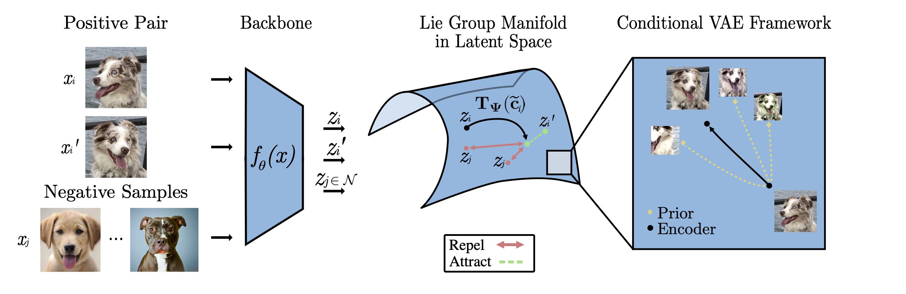

# Manifold Contrastive Learning



Accompanying code for [*Manifold Contrastive Learning with Variational Lie Group Operators*](https://arxiv.org/abs/2306.13544) by Kion Fallah, Alec Helbling, Kyle A. Johnsen, and Christopher J. Rozell.  

## Repo Overview

The main script of interest is `src/experiment.py`. This takes one of the `hyrda` configs (from the `configs` folder) as input and conducts a contrastive learning experiment. Modules related to the Lie group operators and variational inference is in `src/model/manifold`. The main contrastive logic for ManifoldCLR is in `src/model/contrastive/transop_header.py`.

## Dependencies

```
Python          3.9.13
PyTorch         1.12.1
wandb           0.13.5
scikit-learn    1.1.2
hydra-core      1.2.0
lightly         1.2.47
```

TinyImagenet can be downloaded

## Running Contrastive Experiments

### Baselines
#### CIFAR10
```
python src/experiment.py --config-name simclr_cifar10 \
    # Set projection head to MLP, None, Linear, or Direct (DirectCLR)
    ++model_cfg.header_cfg.projection_header_cfg.projection_type=MLP
```

#### STL10
```
python src/experiment.py --config-name simclr_stl10 \
    # Set projection head to MLP, None, Linear, or Direct (DirectCLR)
    ++model_cfg.header_cfg.projection_header_cfg.projection_type=MLP
```

#### TinyImagenet
```
python src/experiment.py --config-name simclr_tinyimagenet \
    # Set projection head to MLP, None, Linear, or Direct (DirectCLR)
    ++model_cfg.header_cfg.projection_header_cfg.projection_type=MLP
```

### ManifoldCLR *with* Proj Head
#### CIFAR10
```
python src/experiment.py --config-name simclr_vi_proj_cifar10
```

#### STL10
```
python src/experiment.py --config-name transop_vi_proj_stl10
```

#### TinyImagenet
```
python src/experiment.py --config-name transop_vi_proj_tin
```

### ManifoldCLR *without* Proj Head
#### CIFAR10
```
python src/experiment.py --config-name simclr_vi_cifar10
```

#### STL10
```
python src/experiment.py --config-name transop_vi_stl10
```

#### TinyImagenet
```
python src/experiment.py --config-name transop_vi_tin
```

### ManifoldCLR with Soft-thresholding
Several configs are included for incorporating soft-thresholding to get machine precision sparsity in the inferred coefficients for the Lie group operators. These techniques use the methods from [*Variational Sparse Coding with Learned Threhsolding*](https://arxiv.org/abs/2205.03665) by Fallah and Rozell. They rely on "max ELBO sampling" (see text for details) which requires large amounts of GPU VRAM. Furthermore, these methods benefit from L2 regularization on the coefficients to increase stability. The CIFAR10 experiments in the paper used this soft-thresholding strategy.

The configs to use are:
```
transop_vi-thresh_cifar10
transop_vi-thresh_stl10
transop_vi-thresh_tin
transop_vi-thresh_proj_cifar10
transop_vi-thresh_proj_stl10
transop_vi-thresh_proj_tin
```


## Running Semi-supervised Experiments

The main script to run the semi-supervised experiments is `src/eval_ssl.py`. The hyper-parameters used for this experiment and the path to the model weights are hard-coded at the top of the file. This script relies on freezing the backbone of a contrastive pre-trained model and training a MLP on top.

There is a fine-tuning script that updates the backbone weights with `src/eval_ssl_finetune.py`, but this script results in overfitting in most cases.